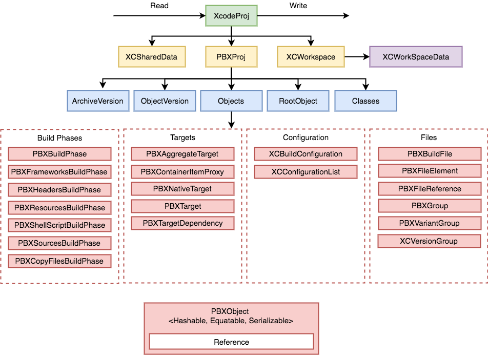

<a href="https://travis-ci.org/swift-xcode/xcodeproj">
    
</a>
<a href="https://swift.org/package-manager">
    
</a>
<a href="https://twitter.com/pepibumur">
    
</a>
<a href="https://github.com/swift-xcode/xcodeproj/releases">
    
</a>
<a href="https://opensource.org/licenses/MIT">
  
</a>
<a>
   <a href="http://swift-xcode.herokuapp.com/"></a>
</a>


xcodeproj is a library written in Swift for parsing and working with Xcode projects. It's heavily inspired in [CocoaPods Xcodeproj](https://github.com/CocoaPods/Xcodeproj) and [xcode](https://www.npmjs.com/package/xcode).

## Motivation 💅
Being able to write command line scripts in Swift to update your Xcode projects configuration. Here you have some examples:

- Add new `Build phases`.
- Update the project `Build Settings`.
- Create new `Schemes`.

## Projects that benefit from xcodeproj ❤️

| **Project** | **Description** |
|---------|-------------|
| [XcodeGen](https://github.com/yonaskolb/XcodeGen)     | Generate Xcode projects dynamically from a YAML file |

## Contribute 👨‍👩‍👧

1. Git clone the repository `git@github.com:swift-xcode/xcodeproj.git`.
2. Generate xcodeproj with  `swift package generate-xcodeproj`.
3. Open `xcodeproj.xcodeproj`.

## Setup 🦋

#### Using Swift Package Manager

Add the dependency in your `Package.swift` file:

```swift
let package = Package(
    name: "myproject",
    dependencies: [
        .package(url: "https://github.com/swift-xcode/xcodeproj.git", .upToNextMajor(from: "0.0.0")),
        ],
    targets: [
        .target(
            name: "myproject",
            dependencies: ["xcodeproj"]),
        ]
)

```

#### Using [Marathon](https://github.com/JohnSundell/Marathon)

Edit your `Marathonfile` and specify the dependency in there:

```bash
https://github.com/swift-xcode/xcodeproj.git
```

#### Using [CocoaPods](https://cocoapods.org)

Edit your `Podfile` and specify the dependency:

```bash
pod "xcodeproj"
```

> Note: xcodeproj is only available for macOS projects.

## How to use xcodeproj 🐒

Xcode provides models that represent Xcode projects and are initialized by parsing the content from your project files. The generated models are classes that can be mutated at any time. These mutations in the models are kept in memory until they are persisted by writing them back to disk by writing either the `XcodeProj` or the `XCWorkspace` model. Modifications in your projects are usually executed in three steps:

1. Read the project or workspace initializing a `XcodeProj` or a `XCWorkspace` object respectively.
2. Modify those objects or any of its dependencies.
3. Write it back to disk.

```swift
// Removing all frameworks build phases
let project = try! XcodeProj(path: "myproject.xcodeproj")
project.pbxproj.frameworksBuildPhases.removeAll()
try! project.write(path: "myproject.xcodeproj")
```

The diagram below shows the sructure of a Xcode project.

A `XcodeProj` has the following properties:
- `XCSharedData` that contains the information about the schemes of the project.
- `XCWorkspace` that defines the structure of the project workspace.
- `PBXProj` that defines the strcuture of the project.

Amongt other properties, the most important one in the `PBXProj` object is `Objects`. Projects are defined by a list of those objects that can be classified in the following groups:

- **Build phases objects**: Define the available build phases.
- **Targets objects**: Define your project targets and dependencies between them.
- **Configuration objects**: Define the available configs and the link between them and the targets.
- **Files objects**: Define the project files, build files and groups.


All objects subclass `PBXObject`, and have an unique & deterministic reference. Moreover, they are hashable and conform the `Equatable` protocol.



You can read more about what each of these objects is for on the [following link](http://www.monobjc.net/xcode-project-file-format.html)

### Considerations
- Objects references are used to define dependencies between objects. In the future we might rather use objects references instead of the unique identifier.
- The write doesn't validate the structure of the project. It's up to the developer to validate the changes that have been done using `xcodeproj`.
- New versions of Xcode might introduce new models or property that are not supported by `xcodeproj`. If you find any, don't hesitate to [open an issue](https://github.com/swift-xcode/xcodeproj/issues/new) on the repository.

## Documentation 📄
You can check out the documentation on the following [link](https://swift-xcode.github.io/xcodeproj/index.html). The documentation is automatically generated in every release by using [Jazzy](https://github.com/realm/jazzy) from [Realm](https://realm.io).

## References 📚

- [PathKit](https://github.com/kylef/PathKit)
- [Xcode Project File Format](http://www.monobjc.net/xcode-project-file-format.html)
- [A brief look at the Xcode project format](http://danwright.info/blog/2010/10/xcode-pbxproject-files/)
- [pbexplorer](https://github.com/mjmsmith/pbxplorer)
- [pbxproj identifiers](https://pewpewthespells.com/blog/pbxproj_identifiers.html)
- [mob-pbxproj](https://github.com/kronenthaler/mod-pbxproj)
- [Xcodeproj](https://github.com/CocoaPods/Xcodeproj)
- [Nanaimo](https://github.com/CocoaPods/Nanaimo)
- [Facebook Buck](https://buckbuild.com/javadoc/com/facebook/buck/apple/xcode/xcodeproj/package-summary.html)
- [Swift Package Manager - Xcodeproj](https://github.com/apple/swift-package-manager/tree/master/Sources/Xcodeproj)

## Contributors ❤️

[](https://github.com/Shakarang)[](https://github.com/yonaskolb)[](https://github.com/pepibumur)

## License

```
MIT License

Copyright (c) 2017 swift-code

Permission is hereby granted, free of charge, to any person obtaining a copy
of this software and associated documentation files (the "Software"), to deal
in the Software without restriction, including without limitation the rights
to use, copy, modify, merge, publish, distribute, sublicense, and/or sell
copies of the Software, and to permit persons to whom the Software is
furnished to do so, subject to the following conditions:

The above copyright notice and this permission notice shall be included in all
copies or substantial portions of the Software.

THE SOFTWARE IS PROVIDED "AS IS", WITHOUT WARRANTY OF ANY KIND, EXPRESS OR
IMPLIED, INCLUDING BUT NOT LIMITED TO THE WARRANTIES OF MERCHANTABILITY,
FITNESS FOR A PARTICULAR PURPOSE AND NONINFRINGEMENT. IN NO EVENT SHALL THE
AUTHORS OR COPYRIGHT HOLDERS BE LIABLE FOR ANY CLAIM, DAMAGES OR OTHER
LIABILITY, WHETHER IN AN ACTION OF CONTRACT, TORT OR OTHERWISE, ARISING FROM,
OUT OF OR IN CONNECTION WITH THE SOFTWARE OR THE USE OR OTHER DEALINGS IN THE
SOFTWARE.
```
