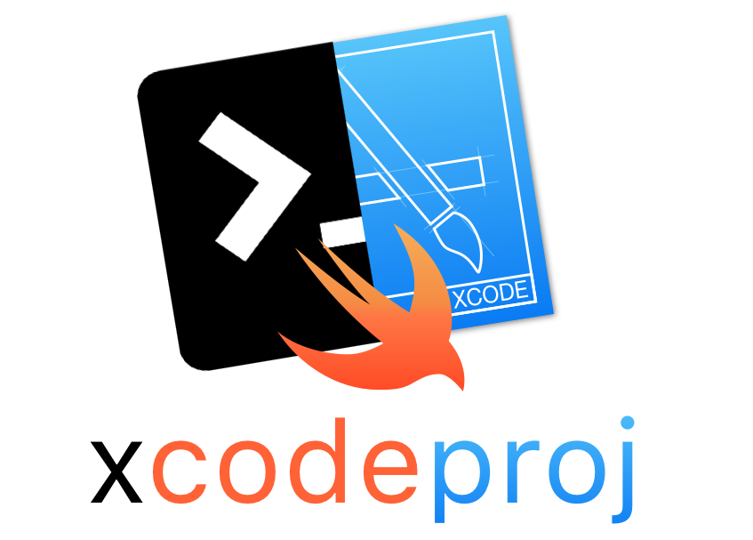

<p align="center">
    
</p>

<p align="center">
    <a href="https://travis-ci.org/pepibumur/xcodeproj">
        
    </a>
    <a href="https://swift.org/package-manager">
        
    </a>
    <a href="https://twitter.com/pepibumur">
        
    </a>
</p>


xcodeproj is a library written in Swift for parsing and working with Xcode projects. It's heavily inspired in [CocoaPods Xcodeproj](https://github.com/CocoaPods/Xcodeproj) and [xcode](https://www.npmjs.com/package/xcode).

### Motivation
Being able to write command line scripts in Swift to update your Xcode projects configuration. Here you have some examples:

- Add new `Build phases`.
- Update the project `Build Settings`.
- Create new `Schemes`.

### Contribute

1. Git clone the repository `git@github.com:cartagoproject/xcodeproj.git`.
2. Open `xcodeproj.xcodeproj`

### References

- [PathKit](https://github.com/kylef/PathKit)
- [Xcode Project File Format](http://www.monobjc.net/xcode-project-file-format.html)
- [A brief look at the Xcode project format](http://danwright.info/blog/2010/10/xcode-pbxproject-files/)
- [pbexplorer](https://github.com/mjmsmith/pbxplorer)
- [pbxproj identifiers](https://pewpewthespells.com/blog/pbxproj_identifiers.html)
- [mob-pbxproj](https://github.com/kronenthaler/mod-pbxproj)
- [Xcodeproj](https://github.com/CocoaPods/Xcodeproj)
- [Nanaimo](https://github.com/CocoaPods/Nanaimo)
- [Facebook Buck](https://buckbuild.com/javadoc/com/facebook/buck/apple/xcode/xcodeproj/package-summary.html)
- [Swift Package Manager - Xcodeproj](https://github.com/apple/swift-package-manager/tree/master/Sources/Xcodeproj)

### How to

#### Reading

You can read the Xcode project files as shown in the examples below:

```swift
// Read a project
let project = try! XcodeProj(path: "myproject.xcodeproj")
let pbxproj = project pbxproj
let buildFiles = pbxproj.objects.buildFiles
let buildConfigurations = pbxproj.objects.buildConfigurations

// Read a workspace
let workspace = try! XCWorkspace(path: "myworkspace.workspace")
let projects = workspace.data.references.map { $0.project }
```


### License

```
MIT License

Copyright (c) 2017 Pedro Piñera Buendía

Permission is hereby granted, free of charge, to any person obtaining a copy
of this software and associated documentation files (the "Software"), to deal
in the Software without restriction, including without limitation the rights
to use, copy, modify, merge, publish, distribute, sublicense, and/or sell
copies of the Software, and to permit persons to whom the Software is
furnished to do so, subject to the following conditions:

The above copyright notice and this permission notice shall be included in all
copies or substantial portions of the Software.

THE SOFTWARE IS PROVIDED "AS IS", WITHOUT WARRANTY OF ANY KIND, EXPRESS OR
IMPLIED, INCLUDING BUT NOT LIMITED TO THE WARRANTIES OF MERCHANTABILITY,
FITNESS FOR A PARTICULAR PURPOSE AND NONINFRINGEMENT. IN NO EVENT SHALL THE
AUTHORS OR COPYRIGHT HOLDERS BE LIABLE FOR ANY CLAIM, DAMAGES OR OTHER
LIABILITY, WHETHER IN AN ACTION OF CONTRACT, TORT OR OTHERWISE, ARISING FROM,
OUT OF OR IN CONNECTION WITH THE SOFTWARE OR THE USE OR OTHER DEALINGS IN THE
SOFTWARE.
```